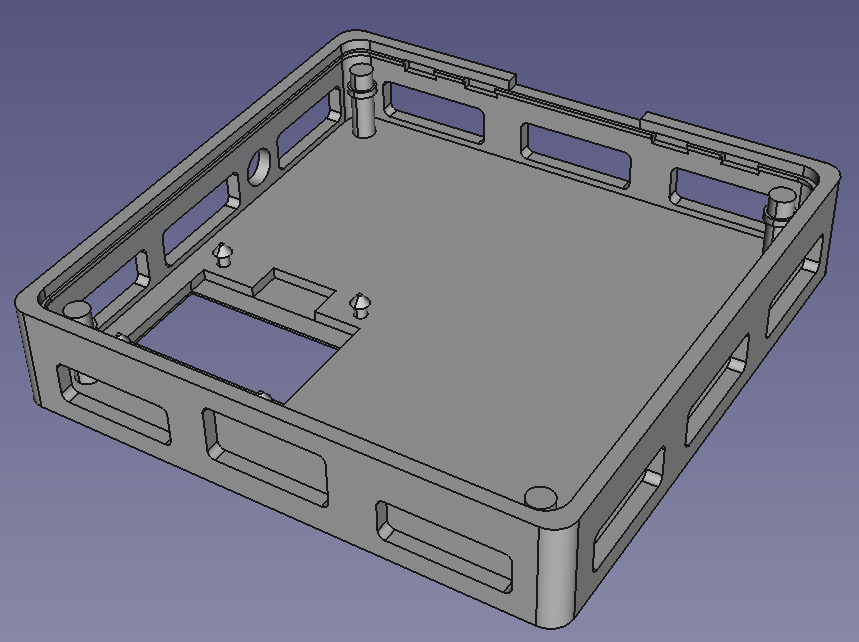
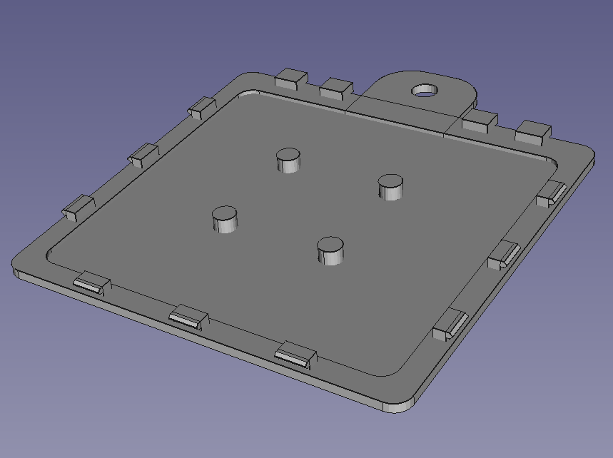

# co2mon.nz Ventilation Monitor Cases

Inspired by https://github.com/oseiler2/CO2Monitor

## Description

This respoitory contains case designs for CO2 based ventilation monitors
intended for fixed (wall-mounted) use in standard residential, office and
retail type spaces. 

 

See https://github.com/co2monnz/co2monitor-pcb for a PCB designed to fit within
the 76mm case in this repository.

The other cases/designs are for use with PCBs from the
https://github.com/oseiler2/CO2Monitor repository.

All the cases are 3D printable in PLA or PETG and have been tested to print
reliably using a Prusa i3 MK3S.

## License, Copyright and Reuse

© 2023 [MKMBA Ltd](https://www.mkmba.nz/).

The CAD files and associated data in this repository are available under the
terms of the CC-BY-NC license detailed in the accompanying LICENSE file. 

There doesn't seem to be any perfect way of licensing hadware designs that I've
found yet, so if the CC-BY-NC terms are not suitable for you please get in
touch and I'll generally be fairly wiling to consider other options including
for commercial re-use, etc.
